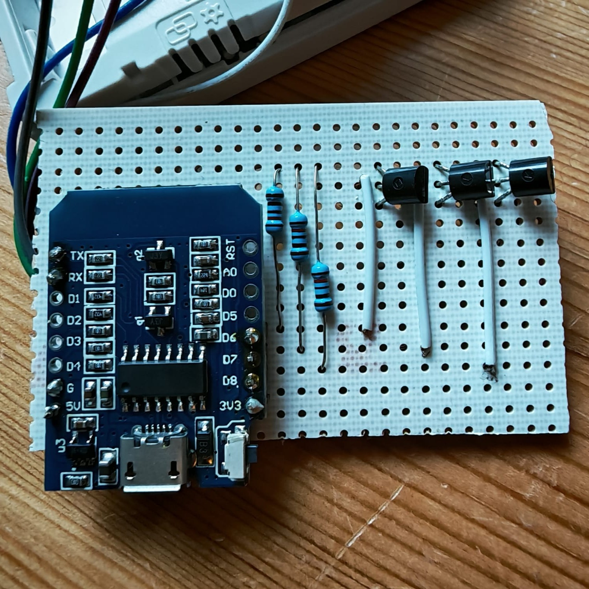
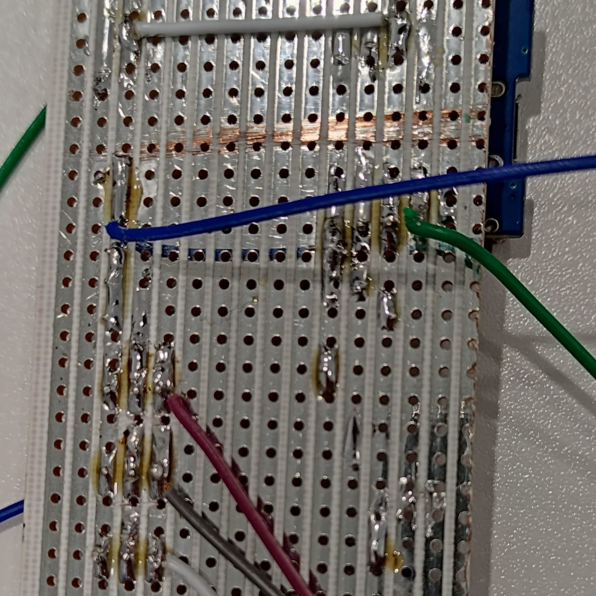
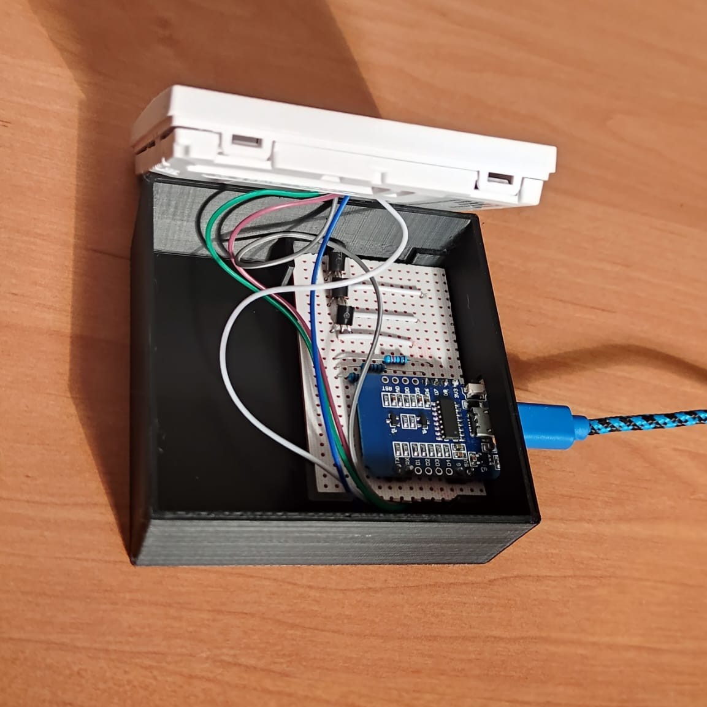
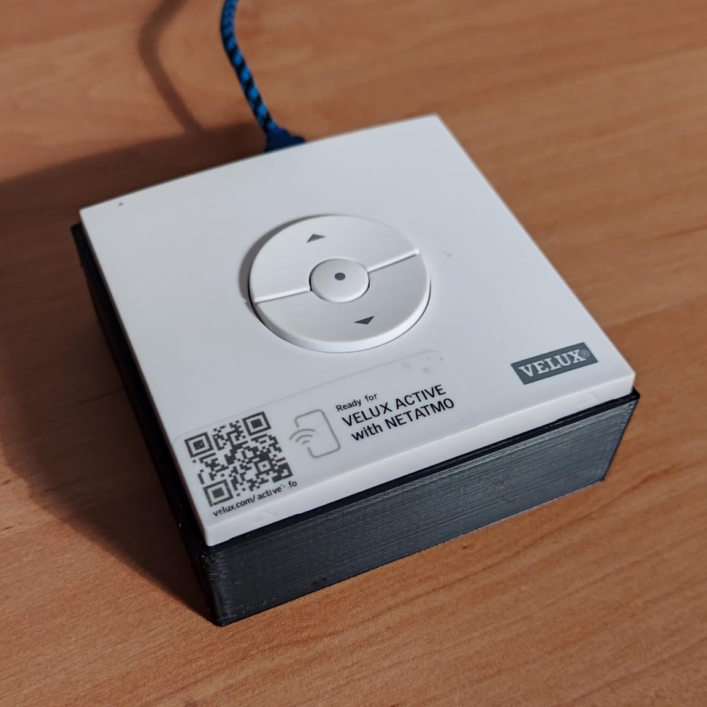
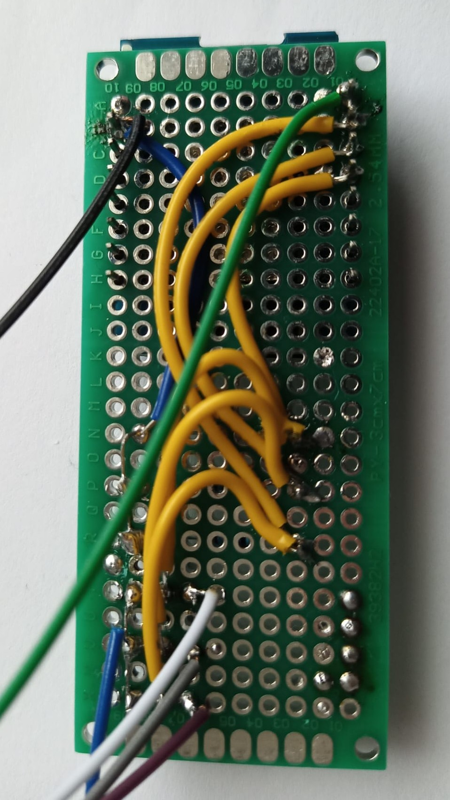

---
tags :
  - projet
  - automatisation
---

# Volets automatiques
 
Je souhaitais automatiser mes 4 Velux afin de pouvoir les fermer automatiquement le soir et les ouvrir le matin à des horaires programmés, ou encore les contrôler à distance.  
J’ai donc créé ma première carte PCB custom afin d’obtenir un rendu final propre et intégré.

## 1. Velux
J’ai commencé par démonter la télécommande de contrôle centrale des Velux.  
Il suffit d’envoyer une impulsion électrique sur la broche du bas pour fermer le Velux. Cette impulsion permet de simuler un appui sur la télécommande (voir image ci-dessous).

[{ style="border-radius:10px ; box-shadow: 0 4px 8px 0 rgba(0, 0, 0, 0.2), 0 6px 20px 0 rgba(0, 0, 0, 0.19);" width="300"}](images/Velux_1.jpg)

---

J’ai réalisé un circuit électronique et effectué les soudures.  
J’utilise un ESP32 pour envoyer les impulsions électriques. L’ESP32 est une carte programmable avec Wi-Fi, qui se connecte à mon assistant domotique Home Assistant.

{ style="border-radius:10px ; box-shadow: 0 4px 8px 0 rgba(0, 0, 0, 0.2), 0 6px 20px 0 rgba(0, 0, 0, 0.19);" width="300"}
{ style="border-radius:10px ; box-shadow: 0 4px 8px 0 rgba(0, 0, 0, 0.2), 0 6px 20px 0 rgba(0, 0, 0, 0.19);" width="300"}

---

J’ai modélisé puis imprimé en 3D le boîtier afin de cacher l’électronique et d’obtenir un produit fini propre.  
L’ensemble est alimenté en USB.

{ style="border-radius:10px ; box-shadow: 0 4px 8px 0 rgba(0, 0, 0, 0.2), 0 6px 20px 0 rgba(0, 0, 0, 0.19);" width="300"}
{ style="border-radius:10px ; box-shadow: 0 4px 8px 0 rgba(0, 0, 0, 0.2), 0 6px 20px 0 rgba(0, 0, 0, 0.19);" width="300"}

---

## 2. somfy 

J’ai réalisé le même circuit pour les volets roulants Somfy.

{ style="border-radius:10px ; box-shadow: 0 4px 8px 0 rgba(0, 0, 0, 0.2), 0 6px 20px 0 rgba(0, 0, 0, 0.19);" width="195"}
{ style="border-radius:10px ; box-shadow: 0 4px 8px 0 rgba(0, 0, 0, 0.2), 0 6px 20px 0 rgba(0, 0, 0, 0.19);" width="300"}

