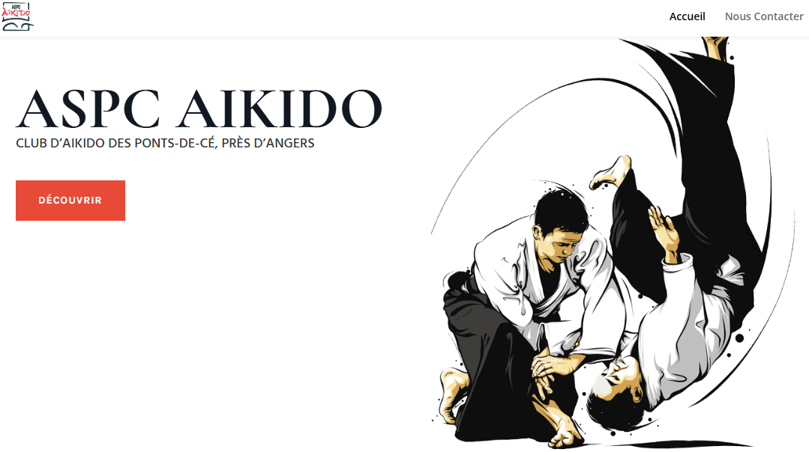
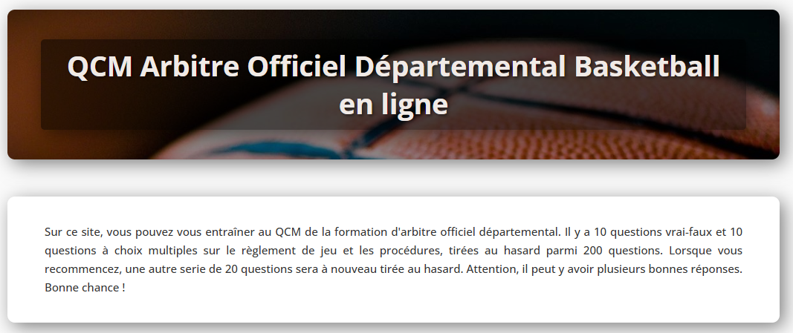

---
tags :
  - projet
  - sitewebs
---

# Les sitewebs que j'ai créés

## 1. Site Aikido 

J'ai créé un site web dédié à un club d'**Aïkido** en utilisant [**WordPress**](https://wordpress.com/fr/){:target="_blank"} et le constructeur de pages [**Divi**](https://www.elegantthemes.com/gallery/divi/){:target="_blank"}. L'objectif était de concevoir un site à la fois esthétique, fonctionnelle et intuitive pour les membres du club et les visiteurs.

Grâce à Divi, j'ai pu personnaliser chaque aspect du design, en harmonisant les couleurs et les typographies pour refléter l'esprit zen et martial de l'Aïkido. J'ai également optimisé le site pour qu'il soit **responsive**, offrant une expérience fluide sur tous les appareils.

{ width="700" align=center style="border-radius:5px ; box-shadow: 0 4px 8px 0 rgba(0, 0, 0, 0.2), 0 6px 20px 0 rgba(0, 0, 0, 0.19);"}

[:octicons-arrow-right-16: lien du site](http://aspc.aikido.angers.free.fr/){:target="_blank" .md-button .md-button--primary  }

## 2. Site QCM arbitre de basket

Sur ce site, vous pouvez vous entraîner au QCM de la formation d'arbitre officiel départemental. Il y a 10 questions vrai-faux et 10 questions à choix multiples sur le règlement de jeu et les procédures, tirées au hasard parmi 200 questions. Lorsque vous recommencez, une autre serie de 20 questions sera à nouveau tirée au hasard. 

{ width="700" align=center style="border-radius:5px ; box-shadow: 0 4px 8px 0 rgba(0, 0, 0, 0.2), 0 6px 20px 0 rgba(0, 0, 0, 0.19);"}

[:octicons-arrow-right-16: lien du site](http://qcm.arbitre.basket.free.fr/){:target="_blank" .md-button .md-button--primary }
