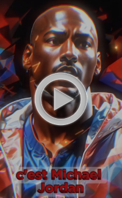

# IA

## Exemple de video sur Michael Jordan

[{: style="float: left ; margin-right: 20px;"  }](video/Jordan_tiktok.mp4 "Redirect Jordan Video"){:target="_blank" embed controls }  

Pour mes vidéos TikTok sur des personnalités célèbres, voici les étapes que j’ai suivies :
### Rédaction du script :
J’ai utilisé [ChatGPT](https://chatgpt.com/) pour créer des scripts engageants qui racontent l’histoire des personnalités choisies. Cet outil me permet d’obtenir rapidement un contenu bien structuré et clair, adapté à une courte vidéo.

### Création des visuels :

Les images utilisées dans les vidéos ont été générées grâce à deux outils d’IA :  
- [Midjourney](https://www.midjourney.com/home), qui permet de créer des illustrations originales à partir d’une description.  
- [Leonardo AI](https://leonardo.ai/), que j’ai utilisé pour enrichir les visuels avec un style unique ou des détails spécifiques.

### Animation des personnages :
Pour donner vie aux images, j’ai utilisé [Vidnoz](https://fr.vidnoz.com/). Cet outil permet d’animer les visages et de les synchroniser avec une voix génerer pas IA, ce qui rend le contenu plus immersif.

### Montage final :
J’ai réalisé le montage avec [CapCut](https://www.capcut.com/fr-fr/). Ce logiciel m’a permis de regrouper les éléments (visuels animés et audio), d’ajouter des sous-titres automatiques pour améliorer l’accessibilité et d’intégrer des transitions ou des effets.

### Temps nécessaire :
Chaque vidéo me prend environ 1 heure à créer, de l’idée initiale à la version finale.

### Ce que j’ai appris :
L’objectif de ces vidéos était de tester différents outils d’intelligence artificielle disponibles aujourd’hui. Ce projet m’a permis de constater à quel point ces technologies évoluent rapidement et combien elles peuvent être accessibles, avec de nombreux outils gratuits en ligne. J’ai également pu améliorer mes compétences en montage vidéo et en création de contenu numérique.

## D'autres vidéos : 

[:octicons-arrow-right-16: lien des autres videos sur tiktok](https://www.tiktok.com/@histoires_de_legende?is_from_webapp=1&sender_device=pc ){ .md-button .md-button--primary }